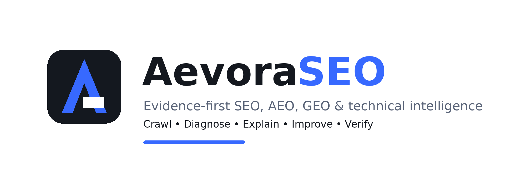
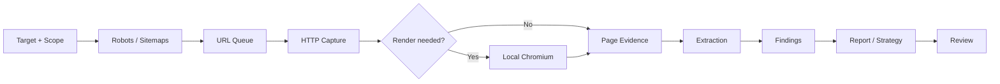

<p align="center">
  
</p>

<h1 align="center">AevoraSEO</h1>

<p align="center">
  <strong>Evidence-first SEO intelligence for websites, content, reputation and search visibility.</strong><br>
  Crawl the real site. Understand the evidence. Build useful improvements. Verify the result.
</p>

<p align="center">
  <a href="LICENSE"></a>
  <a href="https://www.npmjs.com/package/aevoraseo"></a>
  <a href="https://github.com/bhedanikhilkumar-code/aevoraSEO/actions"></a>
  <a href="https://github.com/bhedanikhilkumar-code/aevoraSEO/releases"></a>
  <a href="pyproject.toml"></a>
  <a href="docs/setup.md"></a>
</p>

<p align="center">
  <a href="#npm-quick-start">NPM Quick Start</a> ·
  <a href="#why-aevoraseo">Why AevoraSEO</a> ·
  <a href="#quick-start">Python Setup</a> ·
  <a href="#architecture">Architecture</a> ·
  <a href="#capabilities">Capabilities</a> ·
  <a href="#development">Development</a> ·
  <a href="#roadmap">Roadmap</a>
</p>

---

# NPM Quick Start

Run AevoraSEO instantly anywhere with **Node.js / NPX** — zero manual Python configuration or dependencies setup required:

### Run Instantly with NPX
```bash
# Run a full website SEO, AEO & performance audit
npx aevoraseo audit https://example.com

# Analyze AEO answer readiness & GEO signals on a crawl snapshot
npx aevoraseo aeo ./crawl_output --format terminal

# Compare AEO/GEO readiness trajectory between two snapshots
npx aevoraseo aeo-compare --before ./crawl1 --after ./crawl2 --format terminal

# Extract Schema.org entities, knowledge graph & authority
npx aevoraseo entity ./crawl_output --format terminal

# Compare entity snapshots for evolution & conflict deltas
npx aevoraseo entity-compare --before ./crawl1 --after ./crawl2 --format terminal

# Analyze search intent, keyword cannibalization, local & commercial CTAs
npx aevoraseo search ./crawl_output --format terminal

# Compare search & commercial snapshots across crawls
npx aevoraseo search-compare --before ./crawl1 --after ./crawl2 --format terminal

# Calculate brand entity authority & reputation score
npx aevoraseo reputation example.com

# Discover high-authority backlink opportunities
npx aevoraseo backlinks example.com

# Generate holistic cross-subsystem client audit report (HTML/Terminal/Markdown/JSON/CSV)
npx aevoraseo report ./crawl_output --format terminal

# Verify if prior audit recommendations are resolved in subsequent crawl
npx aevoraseo audit-verify --audit ./audit.json --crawl ./crawl_output

# Track multi-snapshot score trajectory across historical crawls
npx aevoraseo progress --crawls ./snap1 ./snap2 ./snap3

# Generate, preview, and apply automated code patches with atomic backups
npx aevoraseo remediate generate --crawl ./crawl_output --site ./site --out ./remediation
npx aevoraseo remediate preview --plan ./remediation/remediation-plan.json
npx aevoraseo remediate apply --plan ./remediation/remediation-plan.json
npx aevoraseo remediate rollback --receipt ./remediation/remediation-receipt.json

# Inspect engine health and local environment readiness
npx aevoraseo doctor
```

### Global Installation via NPM
```bash
# Install globally
npm install -g aevoraseo

# Run directly from any terminal
aevoraseo audit https://example.com
aevoraseo aeo ./crawl_output
aevoraseo aeo-compare --before ./crawl1 --after ./crawl2
aevoraseo entity ./crawl_output
aevoraseo entity-compare --before ./crawl1 --after ./crawl2
aevoraseo search ./crawl_output
aevoraseo search-compare --before ./crawl1 --after ./crawl2
aevoraseo optimize ./crawl_output
aevoraseo optimize-compare --before ./crawl1 --after ./crawl2
aevoraseo backlinks https://example.com --sources ./sources.csv
aevoraseo reputation https://example.com --sources ./sources.csv
aevoraseo reputation-compare --before ./rep1/reputation.json --after ./rep2/reputation.json
aevoraseo report ./crawl_output --format html --out ./deliverables
aevoraseo audit-verify --audit ./audit.json --crawl ./crawl_output
aevoraseo progress --crawls ./snap1 ./snap2 ./snap3
aevoraseo remediate generate --crawl ./crawl_output --site ./site
aevoraseo remediate preview --plan ./remediation/remediation-plan.json
aevoraseo remediate apply --plan ./remediation/remediation-plan.json
aevoraseo doctor
```

> [!NOTE]
> The NPM package bundles a high-performance native compiled runner. It executes completely locally with zero readable source code exposure and full isolated execution.

---

## Project Evolution and Package Migration

This release changes the public project identity from the previous product name to **AevoraSEO**.

### Migration highlights

- Python distribution renamed to `aevoraseo`.
- NPM CLI package available via `aevoraseo`.
- CLI command renamed to `aevoraseo`.
- Source package moved to `src/aevoraseo/`.
- Documentation, examples, tests and skill metadata updated.
- Project assets replaced with the AevoraSEO visual identity.
- Original creator identity and contact information removed.
- Maintainer metadata now points to **Bheda Nikhilkumar**.
- Public maintainer links verified (GitHub, LinkedIn, Portfolio, and Email).

If you have an existing installation of the old package, treat this as a **breaking rename** and reinstall from a clean environment.

---

## What is AevoraSEO?

**AevoraSEO** is a local-first SEO intelligence and website-audit toolkit that combines a transparent Python crawler with reusable research, content, reputation and reporting workflows.

Instead of treating SEO as a collection of disconnected checklists, AevoraSEO follows one evidence loop:

> **Discover → Crawl → Capture → Analyze → Explain → Improve → Verify**

The project is designed for developers, SEO practitioners, agencies, founders, researchers and AI-assisted workflows that need **inspectable evidence instead of black-box claims**.

### Core idea

AevoraSEO deliberately separates:

- **Observed facts** — what the crawler actually captured.
- **Derived findings** — conclusions calculated from that evidence.
- **Recommendations** — proposed actions based on the findings.
- **Unknowns** — things that could not be verified.
- **Business outcomes** — rankings, traffic, conversions and AI citations that require independent measurement.

That separation is a core product principle. A missing measurement stays missing; it is never silently turned into a confident claim.

---

## Why AevoraSEO?

### 01 — Transparent crawling

The crawler is part of the repository. Request limits, URL discovery, rendering decisions, extraction logic and saved evidence can be inspected and tested.

### 02 — One connected workflow

Technical SEO, content quality, answer readiness, entity consistency, competitors, reputation and follow-up reviews share the same evidence model.

### 03 — Browser-aware research

The engine can work from normal HTTP responses and optionally use local Chromium for JavaScript-heavy pages. Browser mode supports bounded waits and scrolling rather than pretending that every interactive state is automatically captured.

### 04 — Reputation with verification

AevoraSEO distinguishes:

- a real backlink from a search-result snippet,
- a brand mention from a link,
- an owned source from independent editorial recognition,
- a discovered candidate from a verified source,
- a small observed sample from a whole-web backlink index.

### 05 — Reports that explain the work

The report pipeline can produce PDF and HTML deliverables with evidence tables, source notes, findings, priorities and an action roadmap.

### 06 — Local-first operation

The native crawler does not require a proprietary SEO-data subscription or hosted scraping backend. Optional browser, SFTP/FTPS and report dependencies can be installed only when required.

---

# Quick Start (Python Engine & Local Development)
<a id="quick-start"></a>

## Requirements

- Python **3.10+**
- A network environment that permits the websites you intend to inspect
- Optional: local Chromium for JavaScript rendering
- Optional: ReportLab for PDF export
- Optional: Paramiko for SFTP
- Optional: pyftpdlib / pyOpenSSL for hosting tests

Check the environment:

```bash
python3 scripts/run.py doctor
```

On Windows:

```powershell
py -3 scripts/run.py doctor
```

## Install the project

From the repository root:

```bash
python3 -m venv .venv
```

Activate the environment:

```bash
# macOS / Linux
source .venv/bin/activate

# Windows PowerShell
.venv\Scripts\Activate.ps1
```

Install the package:

```bash
python3 -m pip install -e .
```

Install development dependencies:

```bash
python3 -m pip install -e ".[dev]"
```

Install browser support when JavaScript rendering is needed:

```bash
python3 -m pip install -e ".[browser]"
python3 -m playwright install chromium
```

## Run a first crawl

```bash
python3 scripts/run.py crawl https://example.com \
  --out ./client-runs/example \
  --max-pages 25
```

Inspect the generated evidence:

```text
client-runs/example/
├── report.md
├── readiness.md
├── summary.json
├── access.json
├── documents.jsonl
├── content/
├── pages.jsonl
├── pages.csv
├── links.csv
├── issues.json
├── html/
├── screenshots/
└── crawl.sqlite3
```

The exact files depend on the command and enabled features.

## Crawl modes

| Mode | Purpose |
|---|---|
| `auto` | HTTP first, with heuristic browser fallback |
| `http` | Inspect the initial server response |
| `browser` | Render JavaScript content with local Chromium |

Examples:

```bash
# Rapid diagnostic crawl with the quick profile
aevoraseo crawl https://example.com --profile quick --out ./runs/quick-check

# Comprehensive crawl with the deep profile
aevoraseo crawl https://example.com --profile deep --out ./runs/deep-audit

# Incremental crawl (reusing unmodified pages via ETag/304 conditional HTTP requests)
aevoraseo crawl https://example.com --incremental ./runs/baseline --out ./runs/recheck

# Compare two crawl snapshots to detect added, removed, changed & unchanged pages
aevoraseo compare --before ./runs/baseline --after ./runs/recheck --out ./runs/diff

# Analyze AEO answer readiness and GEO signal strength on a crawl snapshot
aevoraseo aeo ./runs/deep-audit --out ./runs/deep-audit/aeo --format terminal

# Compare AEO/GEO score evolution and state transitions between snapshots
aevoraseo aeo-compare --before ./runs/baseline --after ./runs/recheck --out ./runs/aeo-diff --format terminal

# Analyze search intent, cannibalization, local visibility, and commercial CTAs
aevoraseo search ./runs/deep-audit --out ./runs/deep-audit/search --format terminal

# Compare search intent shifts and cannibalization deltas across snapshots
aevoraseo search-compare --before ./runs/baseline --after ./runs/recheck --out ./runs/search-diff --format terminal

# Audit content quality, title/heading hierarchy, answer boxes, topic clusters & schemas
aevoraseo optimize ./runs/deep-audit --out ./runs/deep-audit/optimization --format terminal

# Compare content optimization scores, resolved deficiencies, and cluster evolution
aevoraseo optimize-compare --before ./runs/baseline --after ./runs/recheck --out ./runs/opt-diff --format terminal

# One page with browser rendering
aevoraseo scrape https://example.com/article \
  --out ./runs/article \
  --mode browser \
  --wait-for-selector article \
  --scroll-steps 5

# Capture a browser screenshot
aevoraseo scrape https://example.com \
  --out ./runs/visual \
  --screenshot

# Resume an interrupted snapshot without repeating completed work
aevoraseo crawl https://example.com \
  --out ./runs/example \
  --resume
```

Use a new output directory when you want a genuinely new observation.

---

# Capabilities

AevoraSEO is intentionally broader than a basic metadata checker.

| Area | What it covers |
|---|---|
| Technical SEO | Crawlability, metadata, canonicals, redirects, status codes, sitemaps and access behavior |
| Content | Main content extraction, headings, descriptions, readable Markdown/text and content gaps |
| Content Optimization | Title/meta audits, single H1/hierarchy checks, 40-60w answer boxes, topic clusters, briefs & 30/60/90d roadmaps (`optimize`, `optimize-compare`) |
| Search & Commercial | Search intent taxonomy, target query extraction, keyword cannibalization, and CTA friction audits (`search`, `search-compare`) |
| Schema / entities | JSON-LD observations, organization identity, entity consistency, and intent-matched schema recommendations |
| AEO | AevoraSEO AEO Readiness Score (0–100), direct answers, question coverage, heading hierarchy, and AI bot accessibility |
| GEO | AevoraSEO GEO Signal Score (0–100), entity clarity, author/source readiness, factual density, and extractability |
| AEO/GEO Trajectory | Snapshot-aware score comparisons (`aeo-compare`), state transitions (ADDED, REMOVED, IMPROVED, REGRESSED, UNCHANGED), and attributed evidence |
| Competitors | Business-aware discovery, comparable pages, evidence-backed differences |
| Reputation | Backlink discovery, source inspection, mentions and conservative evidence scoring |
| Backlinks | Source catalog, eligibility checks, publishing routes and verification workflow |
| Local SEO | Business profile and map-oriented audit playbooks |
| Conversion | Journey-oriented findings and page improvement recommendations |
| Reporting | Branded PDF and self-contained HTML reports |
| Review loops | Saved snapshots, bounded watch runs and before/after evidence |
| Hosting | Local, SFTP and FTPS workflows with guarded file changes |
| Assistant skills | Portable `SKILL.md`, playbooks, references and host-specific setup |

See the [capability map](references/capabilities.md) and [AEO & GEO methodology](references/aeo-geo.md) for the detailed workflow.

---

# Architecture

AevoraSEO has two complementary layers.

```text
┌──────────────────────────────────────────────────────────────┐
│                    AevoraSEO Skill Layer                    │
│  Research • Playbooks • Strategy • Writing • Reporting      │
└───────────────────────────────┬──────────────────────────────┘
                                │
                                ▼
┌──────────────────────────────────────────────────────────────┐
│                    Native Python Engine                     │
│  CLI • Crawl • Render • Extract • Evidence • Reports       │
└───────────────────────────────┬──────────────────────────────┘
                                │
                                ▼
┌──────────────────────────────────────────────────────────────┐
│                       Website / Host                        │
│  HTTP • Robots • Sitemap • HTML • JS • Links • Assets      │
└──────────────────────────────────────────────────────────────┘
```

### Crawl pipeline



### Evidence lifecycle

1. **Discover** — identify URLs and permitted sources.
2. **Capture** — store the response and access outcome.
3. **Extract** — parse text, metadata, links, schema and related observations.
4. **Normalize** — convert observations into consistent records.
5. **Analyze** — generate findings using explicit rules.
6. **Explain** — attach evidence and practical impact.
7. **Recommend** — propose a fix and an acceptance check.
8. **Verify** — recrawl or inspect the changed state.

This makes an audit repeatable instead of turning it into a one-time screenshot of a website.

---

# Robots, permissions and safety boundaries

AevoraSEO respects robots rules by default.

An owner-authorized override can be recorded when appropriate, but it does **not** bypass:

- authentication,
- CAPTCHAs,
- server-level denials,
- access controls,
- private resources without authorization.

The crawler also applies URL and response-size boundaries to reduce accidental overreach.

Read:

- [Permissions model](docs/permissions.md)
- [Security policy](SECURITY.md)
- [Crawler reference](references/crawler.md)

Keep client credentials, private reports, cookies and environment files outside the repository.

---

# Reputation and backlink methodology

AevoraSEO does not pretend to be a complete commercial backlink index.

The workflow is:

```text
Discovery
   ↓
Candidate source
   ↓
Source-page inspection
   ↓
Link / mention classification
   ↓
Ownership / independence checks
   ↓
Evidence quality
   ↓
Conservative assessment
```

A search snippet can be useful for discovery, but it is not automatically a verified backlink.

Likewise:

- a directory listing is not automatically editorial recognition,
- an owned property is not automatically independent authority,
- a source-sheet metric is not automatically a current authority measurement,
- a small inspected sample is not the entire web.

The project can calculate its own evidence-based reputation measure, but that number should not be confused with a search-engine ranking factor or a proprietary provider's authority metric.

Read the [reputation methodology](references/reputation.md) and [plain-language scoring guide](docs/scoring-explained.md).

---

# Research and competitor workflow

AevoraSEO is designed to compare businesses **only after understanding the business being audited**.

The workflow establishes:

1. services,
2. customers,
3. markets,
4. important locations,
5. languages,
6. buyer phrases,
7. customer questions,
8. relevant pages.

Candidate competitors are then inspected using comparable evidence.

The output should explain:

- why a candidate is relevant,
- which pages support the comparison,
- what differences were actually observed,
- what remains unknown,
- which opportunities can be acted upon.

Read [discovery and competitor research](docs/discovery-and-competitors.md).

---

# Content and answer readiness

AevoraSEO treats content as an information-quality problem, not simply a keyword-density problem.

Useful outputs can include:

- service-page structures,
- direct-answer sections,
- FAQs,
- comparison content,
- internal-link plans,
- entity and organization facts,
- JSON-LD recommendations,
- titles and descriptions,
- supporting articles,
- content refresh plans,
- 30/60/90-day editorial roadmaps.

The core rule is simple:

> **Do not invent facts to make a page look complete.**

Unsupported claims should remain flagged until the underlying fact is verified.

---

# Reporting

The report pipeline supports:

- Markdown findings,
- HTML deliverables,
- PDF exports,
- linked contents,
- evidence tables,
- source notes,
- action roadmaps,
- business context,
- explicit coverage limitations.

Example:

```bash
python3 scripts/run.py present \
  --input /path/to/client/report-content.json \
  --out /path/to/client/deliverable
```

Report design guidance is documented in [branded reports](docs/branded-reports.md).

---

# Automated Remediation & Code Patches

AevoraSEO converts diagnostic findings and optimization roadmaps into concrete, syntax-safe HTML and metadata code patches with guaranteed atomic rollback:

```text
Crawl & Audit ──► Generate Plan ──► Preview Diff ──► Apply (with Backup) ──► Verify Fix
```

### Key Capabilities
- **Deterministic AST Patches:** Safe BeautifulSoup manipulation preserving document formatting for `<title>`, `<meta name="description">`, `<h1>`–`<h6>` hierarchy, Schema.org JSON-LD, canonical tags, and contextual internal links.
- **Direct Answer Engineering:** Automated injection of semantic 40–60 word answer boxes and procedural lists beneath question headings for AEO/GEO engine discovery.
- **Atomic Safety & Backups:** Automatic pre-patch byte backup to `.aevora/backups/`, cryptographic SHA-256 pre/post digests, and tamper-evident `remediation-receipt.json`.
- **Verified Rollback:** Restore exact original file bytes with verified checksum validation (`aevoraseo remediate rollback`).
- **SQLite Persistence:** Audit-trail tracking across `remediations.sqlite3`.

```bash
# Generate remediation plan from crawl findings targeting local site
aevoraseo remediate generate --crawl ./crawl_output --site ./site --out ./remediation

# Preview colorized unified diffs without modifying files
aevoraseo remediate preview --plan ./remediation/remediation-plan.json

# Apply patches with automatic backup and receipt creation
aevoraseo remediate apply --plan ./remediation/remediation-plan.json

# Rollback applied changes back to exact pre-patch state
aevoraseo remediate rollback --receipt ./remediation/remediation-receipt.json
```

Detailed guides: [Remediation User Guide](docs/remediation.md) and [Methodology Reference](references/remediation-engine.md).

---

# Assistant / Skill installation

The repository contains a portable `SKILL.md` and supporting playbooks.

Supported workflows include:

| Environment | Starting point | Status |
|---|---|---|
| Claude Code | [Claude Code setup](docs/agent-installation.md#claude-code) | VERIFIED |
| Codex | [Codex setup](docs/agent-installation.md#codex) | VERIFIED |
| Hermes Agent | [Hermes setup](docs/agent-installation.md#hermes-agent) | VERIFIED |
| OpenClaw | [OpenClaw setup](docs/agent-installation.md#openclaw) | VERIFIED |
| ChatGPT Work | [Work setup](docs/agent-installation.md#chatgpt-work) | DOCUMENTED |
| aider | [Multi-agent guide](references/multi-agent-compatibility.md) | DOCUMENTED |
| Copilot CLI | [Multi-agent guide](references/multi-agent-compatibility.md) | DOCUMENTED |
| Gemini CLI | [Multi-agent guide](references/multi-agent-compatibility.md) | DOCUMENTED |
| Droid / Kilocode / OpenCode / Qwen / etc. | [Multi-agent guide](references/multi-agent-compatibility.md) | NOT VERIFIED |
| Terminal / Python | Run the native engine directly | VERIFIED |

### Multi-Agent CLI Commands

```bash
# Auto-detect active agent platform and workspace
npx aevoraseo agent detect

# List all 18 supported platforms and verification statuses
npx aevoraseo agent list

# Inspect detailed integration specifications
npx aevoraseo agent inspect claude-code

# Generate adapter or configuration files for a platform
npx aevoraseo agent adapt aider

# Run fixture-based compatibility verification tests
npx aevoraseo agent verify
```

The installer can validate and configure a supported host:

```bash
python3 scripts/install_skill.py --host claude-code --setup
```

Use `python3 scripts/install_skill.py --help` for host-specific options.

---

# Example engagement

A practical request might look like:

```text
Audit https://example.com.

First understand the business, target customers, services and markets.
Then crawl the site within a 50-page limit.

Report:
- technical SEO findings,
- content and answer-readiness gaps,
- entity/schema observations,
- relevant competitors,
- verified reputation evidence,
- useful content opportunities,
- a 30/60/90-day action plan.

For every major recommendation, show:
1. what was observed,
2. why it matters,
3. what to change,
4. how to verify the change.

Do not invent rankings, traffic, backlinks or AI citations.
Clearly label anything that could not be verified.
```

The important part is not the wording of the prompt. The important part is that the workflow preserves evidence and uncertainty.

---

# Repository structure

```text
aevoraseo/
├── .github/
│   ├── ISSUE_TEMPLATE/
│   └── workflows/
├── assets/
│   ├── aevoraseo-logo.png
│   ├── aevoraseo-banner.png
│   └── README.md
├── docs/
│   ├── README.md
│   ├── setup.md
│   ├── architecture.md
│   ├── agent-installation.md
│   ├── discovery-and-competitors.md
│   ├── branded-reports.md
│   └── ...
├── examples/
│   ├── README.md
│   ├── posting-profile.json
│   └── ...
├── playbooks/
│   ├── audit/
│   ├── aeo-geo/
│   ├── backlink-system/
│   ├── competitor-research/
│   ├── core/
│   ├── integrations/
│   ├── local-seo/
│   ├── reporting/
│   └── strategy/
├── references/
├── scripts/
├── src/
│   └── aevoraseo/
├── tests/
├── CITATION.cff
├── CHANGELOG.md
├── CONTRIBUTING.md
├── LICENSE
├── SECURITY.md
├── SKILL.md
├── pyproject.toml
└── README.md
```

---

# Development

## Install development dependencies

```bash
python3 -m pip install -e ".[dev]"
```

## Run the test suite

```bash
python3 -m pytest -q
```

## Run formatting / lint checks

```bash
ruff check .
```

If a formatter is configured for the active branch, run the repository's documented formatting command before opening a pull request.

## Validate the skill

```bash
python3 scripts/validate_skill.py
```

## Build the skill package

```bash
python3 scripts/build_skill.py
```

## Check release hygiene

```bash
python3 scripts/check_release.py
```

Before submitting a change, run the smallest relevant test set first, then the complete regression suite when practical.

---

# Testing philosophy

AevoraSEO's tests are designed around behavior and boundaries, not just line coverage.

Important areas include:

- crawler discovery,
- HTTP handling,
- browser rendering,
- metadata extraction,
- content extraction,
- link handling,
- reputation logic,
- discovery fallbacks,
- report generation,
- portability,
- hosting transports,
- installation behavior,
- release hygiene,
- regression cases.

When adding a feature, prefer tests that prove the observable contract.

When fixing a bug:

1. reproduce it,
2. add a regression test,
3. implement the smallest correct fix,
4. run the focused test,
5. run the broader suite,
6. update documentation when behavior changes.

---

# Project roadmap

The project is intentionally iterative.

### Current foundation

- Local Python crawler
- HTTP and optional browser rendering
- Saved crawl evidence
- SEO/content extraction
- AEO/GEO/entity workflows
- Competitor research
- Reputation and backlink workflows
- Branded report generation
- Portable assistant skill
- Local/SFTP/FTPS operational workflows
- Automated regression coverage

### Next improvement tracks

- Better crawl diagnostics and observability
- Faster large-site processing
- More structured evidence schemas
- Stronger test fixtures
- Better report customization
- More explicit plugin/integration boundaries
- Improved configuration validation
- More deterministic research outputs
- Clearer extension APIs
- Better contributor tooling
- Release automation and reproducible packaging

The roadmap is evidence-driven: features should solve a real workflow problem without weakening the project's transparency.

---

# Design principles

### Evidence over assumptions

If it was not observed or independently supplied, label it as unknown.

### Conservative over impressive

A smaller verified result is more useful than a larger invented number.

### Local-first over unnecessary infrastructure

Use local execution when it provides enough capability.

### Modular over monolithic

Crawler, reporting, reputation, playbooks and integrations should remain separable.

### Reproducible over magical

A future contributor should be able to understand how a result was produced.

### Safe changes over blind automation

Review changes before applying them to a live website, preserve backups and verify the result afterward.

### Useful output over jargon

A report should help someone decide what to do next.

---

# Limitations

AevoraSEO is **not**:

- a complete commercial backlink index,
- a search-engine ranking predictor,
- a guaranteed traffic-growth system,
- a replacement for Google Search Console or analytics data,
- proof that a page will appear in an AI answer,
- a universal JavaScript browser automation framework,
- permission to crawl private or restricted systems.

Search rankings, traffic, conversions, indexing and AI citations require their own measurements.

A crawler can tell you what it observed. It cannot honestly manufacture what it did not observe.

---

# Security and privacy

Please do not commit:

- passwords,
- API keys,
- cookies,
- private client reports,
- private crawl exports,
- credentials,
- production secrets,
- personally identifying customer datasets.

Use environment variables or an appropriate secret manager for runtime credentials.

See [SECURITY.md](SECURITY.md) for the reporting process.

---

# Documentation

| Start here | Deep dive |
|---|---|
| [Setup](docs/setup.md) | [Architecture](docs/architecture.md) |
| [Assistant installation](docs/agent-installation.md) | [Crawler reference](references/crawler.md) |
| [Questions and examples](docs/questions.md) | [Capability map](references/capabilities.md) |
| [Discovery and competitors](docs/discovery-and-competitors.md) | [Reputation methodology](references/reputation.md) |
| [Operations](docs/operations.md) | [Measurement boundaries](references/measurement-boundaries.md) |
| [Branded reports](docs/branded-reports.md) | [Deep research](docs/deep-research.md) |
| [Backlink source catalog](docs/backlink-source-catalog.md) | [Development guide](docs/development.md) |

Full index: [docs/README.md](docs/README.md)

---

# Maintainer

**Bheda Nikhilkumar**  
Engineering Student · Software Development

AevoraSEO is maintained as an independent software project focused on practical SEO engineering, transparent automation and evidence-based website analysis.

### Connect

The project is maintained by Bheda Nikhilkumar. Public maintainer links are listed below.

- **GitHub:** https://github.com/bhedanikhilkumar-code
- **LinkedIn:** https://www.linkedin.com/in/bhedanikhilkumar
- **Portfolio:** https://github.com/bhedanikhilkumar-code/Bheda-Nikhilkumar-portfolio
- **Email:** bhedanikhilkumarpro@gmail.com

---

# License

AevoraSEO is released under the **MIT License**.

See [LICENSE](LICENSE) and [THIRD_PARTY_NOTICES.md](THIRD_PARTY_NOTICES.md).

---

<p align="center">
  <strong>AevoraSEO</strong><br>
  Evidence first. Clear reasoning. Better websites.
</p>
