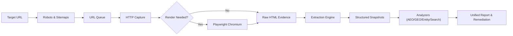

<p align="center">
  
</p>

<h1 align="center">AevoraSEO</h1>

<p align="center">
  <strong>Autonomous SEO, AEO & GEO intelligence platform for modern search, answer engines, and generative discovery.</strong><br>
  Crawl the real site. Verify the evidence. Diagnose search foundations. Remediate with deterministic code patches.
</p>

<p align="center">
  <a href="LICENSE"></a>
  <a href="https://www.npmjs.com/package/aevoraseo"></a>
  <a href="https://github.com/bhedanikhilkumar-code/aevoraSEO/releases/tag/v1.1.0"></a>
  <a href="pyproject.toml"></a>
  <a href="package.json"></a>
  <a href="#development--testing"></a>
  <a href="docs/setup.md"></a>
</p>

<p align="center">
  <a href="#quick-start">Quick Start</a> ·
  <a href="#windows-quick-start">Windows Setup</a> ·
  <a href="#linux--macos-quick-start">Linux Setup</a> ·
  <a href="#cli-command-reference">CLI Reference</a> ·
  <a href="#the-connected-search-model">Intelligence Model</a> ·
  <a href="#automated-remediation">Automated Remediation</a> ·
  <a href="#architecture--how-it-works">Architecture</a> ·
  <a href="#documentation">Documentation</a>
</p>

---

## What AevoraSEO Is

**AevoraSEO** is a professional, local-first search intelligence engine and autonomous audit toolkit. It combines an inspectable Python crawler, deterministic structured analyzers, and an automated HTML/metadata remediation engine to diagnose and improve website visibility across traditional search engines, answer engines (AEO), and generative AI discovery engines (GEO).

Instead of treating search optimization as a series of disconnected checklists, AevoraSEO executes one continuous, inspectable loop:

```text
Discover ──► Crawl ──► Capture Evidence ──► Analyze ──► Prioritize ──► Remediate ──► Verify ──► Track Progress
```

### The Core Principle: Evidence First

AevoraSEO enforces a strict architectural boundary between observed facts and derived metrics:

* **Observed Facts** — Exact HTTP response headers, status codes, HTML markup, JSON-LD schemas, rendered DOM, and robots directives captured directly from the target.
* **Derived Findings** — Deterministic audit findings computed strictly from observable evidence.
* **Prioritized Recommendations** — Specific, actionable remediation steps ranked by impact (P0 / P1 / P2).
* **Unknowns** — Unverified claims or unmeasured attributes explicitly marked as unknown rather than guessed.
* **External Outcomes** — Empirical search rankings, traffic figures, and live AI model citations that require authenticated first-party data or independent measurement.

> [!NOTE]
> AevoraSEO never manufactures false certainty. If a metric was not directly observed, it is recorded as unobserved — never converted into an unsupported ranking claim.

---

## Why AevoraSEO?

* **⚡ Transparent Local Crawler** — Full control over crawl profiles (`quick`, `standard`, `deep`), request concurrency, rate limits, robots enforcement, and ETag/304 conditional request caching.
* **🧠 Multi-Engine Coverage** — Built from the ground up for traditional SEO, Answer Engine Optimization (AEO), and Generative Engine Optimization (GEO).
* **🔍 Entity & Knowledge Graph Intelligence** — Multi-source Schema.org extraction (JSON-LD, Microdata, OpenGraph), `sameAs` authority footprint auditing, and cross-page entity conflict detection.
* **📊 Conservative Reputation Scoring** — Rigorous classification distinguishing real backlinks from search snippets, verified mentions from noise, and owned assets from independent editorial recognition.
* **🛠️ Automated Code Remediation (Phase K)** — Generates deterministic, syntax-safe HTML and metadata code patches with unified diff previews, pre-flight safety checks, atomic backups, SHA-256 receipts, and verified rollback.
* **🚀 Zero-Key Local Operation** — The core engine requires no expensive commercial SEO subscription, third-party API key, or external cloud daemon.

---

## The Connected Search Model

Modern search extends far beyond simple keyword density. AevoraSEO evaluates websites across seven interconnected dimensions:

```text
┌─────────────────────────────────────────────────────────────────────────────────┐
│                          AevoraSEO Intelligence Suite                           │
├─────────────────┬─────────────────┬──────────────────┬──────────────────────────┤
│ 1. SEO          │ 2. AEO          │ 3. GEO           │ 4. Entity & Authority    │
│ Technical crawl,│ Direct answers, │ Factual density, │ Schema knowledge graph,  │
│ status codes,   │ question intent,│ citation readiness, sameAs footprint,       │
│ metadata, links │ bot access      │ extractability   │ consistency audits       │
├─────────────────┴─────────────────┼──────────────────┴──────────────────────────┤
│ 5. Reputation & Backlinks         │ 6. Search & Commercial Intelligence         │
│ Verified sources, anchor context, │ Intent taxonomy, keyword cannibalization,   │
│ conservative evidence scoring     │ local NAP visibility, CTA friction audits   │
├───────────────────────────────────┴─────────────────────────────────────────────┤
│ 7. Automated Remediation (Phase K)                                              │
│ Deterministic AST/HTML code patches, unified diffs, atomic backups & rollback   │
└─────────────────────────────────────────────────────────────────────────────────┘
```

### 1. Traditional Technical SEO
Inspects crawlability, canonicals, redirect chains, HTTP status codes, XML sitemaps, robots.txt directives, title tags, meta descriptions, and internal link graph topology (including orphan page detection).

### 2. AEO — Answer Engine Optimization
Audits content readiness for conversational question-answering engines. Identifies 40–60 word direct-answer definitions, procedural step lists, question heading coverage (`H2`/`H3`), and evaluates crawler accessibility across 10 tracked AI bots (GPTBot, ClaudeBot, PerplexityBot, etc.).

### 3. GEO — Generative Engine Optimization
Measures content extractability, factual density, authoritative author bylines, publication timestamps, and structured knowledge representations that generative engines prioritize when synthesizing citations.

### 4. Entity & Knowledge Graph Intelligence
Parses typed Schema.org models (`Organization`, `Person`, `Product`, `LocalBusiness`, `Article`), resolves external `sameAs` authority links (Wikidata, Wikipedia, LinkedIn, Crunchbase), and detects cross-page consistency conflicts (name contradictions, telephone mismatches, broken profiles).

### 5. Reputation & Backlinks
Verifies backlinks through direct source-page inspection. Evaluates anchor text, `rel` attributes (dofollow, nofollow, ugc, sponsored), and surrounding 160-character sentence context. Separates owned platforms from independent third-party editorial citations.

### 6. Search & Commercial Visibility
Classifies search intent (Informational, Commercial Investigation, Transactional, Navigational, Local), extracts primary target queries, detects internal keyword cannibalization via token similarity, validates local NAP consistency, and audits commercial conversion paths.

### 7. Automated Remediation Engine
Bridges the gap between auditing and engineering by compiling findings into deterministic, syntax-safe HTML patches with colorized diff previews, automatic pre-patch backups, and instant rollback.

---

## Core Capabilities

| Capability | Subsystem | Description | Output Artifacts |
|---|---|---|---|
| **Technical Crawling** | `crawl`, `scrape` | Multi-profile web crawler with incremental caching, ETag/304 reuse, and optional Chromium rendering | `crawl.sqlite3`, `pages.jsonl`, `links.csv` |
| **Unified Client Audit** | `report` | Synthesizes technical, content, AEO, GEO, entity, and search metrics into one health scorecard | `audit-report.html`, `report.json`, `issues.csv` |
| **AEO & GEO Scoring** | `aeo`, `aeo-compare` | Answer readiness, question coverage, direct-answer proximity, AI bot accessibility matrix | `aeo_report.json`, `aeo_pages.csv`, `aeo_diff.md` |
| **Entity & Authority** | `entity`, `entity-compare` | Schema.org knowledge graph, typed entities, `sameAs` footprint, cross-page conflict audit | `entities.json`, `entity-graph.json`, `conflicts.csv` |
| **Search & Commercial** | `search`, `commercial` | Search intent taxonomy, query extraction, cannibalization detection, local NAP and CTA audits | `page-intents.csv`, `cannibalization.csv` |
| **Content Optimization** | `optimize`, `content` | Title/meta audits, heading hierarchy, 40-60w answer boxes, topic clusters, 30/60/90d roadmaps | `content-recommendations.csv`, `briefs.json` |
| **Backlink Verification** | `backlinks` | Direct source-page verification, anchor text, dofollow resolution, context excerpts | `backlinks.json`, `backlinks.csv`, `sources.csv` |
| **Reputation Assessment** | `reputation` | Evidence-based reputation score (0–100), brand mentions, unlinked outreach opportunities | `reputation.json`, `reputation-sources.csv` |
| **Automated Remediation** | `remediate` | AST/HTML code patch engine: generate plans, preview diffs, apply with atomic backup, rollback | `remediation-plan.json`, `receipt.json` |
| **Progress Tracking** | `progress` | Multi-snapshot trajectory tracking across historical crawls (score deltas, issue resolution) | `progress.json`, terminal scorecards |
| **Audit Verification** | `audit-verify` | Verifies whether prior audit recommendations were resolved or persist in subsequent crawls | `verification.json`, verification reports |
| **Branded Presentations** | `present` | Exports professional, offline client deliverables in standalone HTML or PDF format | Standalone HTML / PDF deliverables |
| **Multi-Agent Runtime** | `agent` | Environment detector, adapter generator, and compatibility verifier across 18 agent platforms | Adapter configs, platform inspection specs |
| **Runtime Diagnostics** | `doctor` | Verifies local Python environment, Playwright/Chromium dependencies, and network reachability | Diagnostics JSON / terminal status |

---

## Quick Start

### Prerequisites

* **Python:** `3.10+` (verified on Python 3.10, 3.11, 3.12, 3.14)
* **Node.js:** `>=16.0.0` (required only if using NPX or Node CLI runner)
* **Git:** standard release
* **Optional:** Chromium via Playwright (required only for JavaScript rendering mode)

---

### Windows Quick Start

Open **PowerShell** and run:

```powershell
# 1. Clone the repository
git clone https://github.com/bhedanikhilkumar-code/aevoraSEO.git
cd aevoraSEO

# 2. Create and activate a Python virtual environment
python -m venv .venv
.venv\Scripts\Activate.ps1

# 3. Upgrade pip and install AevoraSEO in editable mode
python -m pip install --upgrade pip
pip install -e .

# 4. Smoke test the CLI
aevoraseo --help
aevoraseo doctor
```

> [!TIP]
> If your PowerShell restricts script execution, run `Set-ExecutionPolicy -Scope Process -ExecutionPolicy Bypass` before activating `.venv`.

---

### Linux & macOS Quick Start

Open your terminal and run:

```bash
# 1. Clone the repository
git clone https://github.com/bhedanikhilkumar-code/aevoraSEO.git
cd aevoraSEO

# 2. Create and activate a virtual environment
python3 -m venv .venv
source .venv/bin/activate

# 3. Upgrade pip and install AevoraSEO in editable mode
python3 -m pip install --upgrade pip
pip install -e .

# 4. Smoke test the CLI
aevoraseo --help
aevoraseo doctor
```

---

### Run Instantly with NPX (Node.js)

If Node.js is installed, execute commands directly via NPX without manual setup:

```bash
# Run environment diagnostics
npx aevoraseo doctor

# Crawl a target website
npx aevoraseo crawl https://example.com --profile quick --out ./runs/quick-check

# Generate a unified client audit report
npx aevoraseo report ./runs/quick-check --format terminal
```

---

## Simple "First Audit" Example

Execute a complete audit in three steps:

### Step 1: Crawl the Website
Run a fast diagnostic crawl to gather raw technical evidence:

```bash
aevoraseo crawl https://example.com --profile quick --out ./runs/example-baseline
```

*What it does:* Crawls within host boundaries, respects `robots.txt`, captures response headers and HTML, extracts links and metadata, and stores observations in `./runs/example-baseline/crawl.sqlite3`.

### Step 2: Generate the Unified Report
Compile raw evidence across technical, content, entity, and AEO dimensions:

```bash
aevoraseo report ./runs/example-baseline --format terminal
```

*What to expect:* A calibrated health scorecard (0–100), breakdown of critical P0 blockers, high-impact P1 opportunities, and P2 maintenance tasks.

To export an executive HTML presentation for stakeholders:

```bash
aevoraseo report ./runs/example-baseline --format html --out ./deliverables
```

Inspect the generated deliverable at `./deliverables/audit-report.html`.

### Step 3: Check Answer & Search Readiness
Analyze AEO answer boxes and generative discovery signals:

```bash
aevoraseo aeo ./runs/example-baseline --format terminal
```

---

## CLI Command Reference

The AevoraSEO CLI exposes 36 real public commands and aliases across all intelligence systems:

| Command | Category | Purpose | Typical Syntax |
|---|---|---|---|
| `crawl` | Core Crawler | Crawl website structure, discover links, and capture evidence | `aevoraseo crawl <url> --out <dir> [--profile quick\|standard\|deep]` |
| `scrape` | Core Crawler | Inspect and capture a single web page with optional browser rendering | `aevoraseo scrape <url> --out <dir> [--mode browser] [--screenshot]` |
| `watch` | Monitoring | Bounded change observation and re-crawling across set intervals | `aevoraseo watch <url> --out <dir> --cycles 3 --interval 3600` |
| `report` | Reporting | Generate unified cross-subsystem audit report (HTML, terminal, MD, CSV) | `aevoraseo report <crawl-dir> --format html --out <dir>` |
| `audit-verify` | Workflow | Verify whether prior audit recommendations are resolved in new crawl | `aevoraseo audit-verify --audit <audit.json> --crawl <crawl-dir>` |
| `progress` | Workflow | Track multi-snapshot score trajectory across historical crawls | `aevoraseo progress --crawls <snap1> <snap2> <snap3>` |
| `present` | Reporting | Export an offline branded HTML/PDF client deliverable from report JSON | `aevoraseo present --input <report.json> --out <dir> --format html` |
| `doctor` | Diagnostics | Check CLI runtime, Playwright dependencies, and network health | `aevoraseo doctor [--target <url>]` |
| `browser-setup`| Diagnostics | Check and install missing Playwright Chromium browser binaries | `aevoraseo browser-setup` |
| `readiness` | Intelligence | Explain search and answer readiness from saved crawl evidence | `aevoraseo readiness --out <crawl-dir>` |
| `compare` | Core Crawler | Compare two crawl snapshots for added, changed, and removed pages | `aevoraseo compare --before <snap1> --after <snap2> --out <dir>` |
| `aeo` | AEO / GEO | Analyze answer readiness, question coverage, and AI bot access | `aevoraseo aeo <snapshot-dir> --format terminal` |
| `aeo-compare` | AEO / GEO | Compare AEO/GEO score evolution and state transitions between crawls | `aevoraseo aeo-compare --before <snap1> --after <snap2>` |
| `entity` | Entity / Graph | Extract Schema.org entities, knowledge graph, and authority conflicts | `aevoraseo entity <target> --format terminal` |
| `entity-compare`| Entity / Graph | Track entity evolution, score deltas, and resolved schema conflicts | `aevoraseo entity-compare --before <snap1> --after <snap2>` |
| `search` | Commercial | Analyze search intent taxonomy, cannibalization, and CTA friction | `aevoraseo search <target> --format terminal` |
| `commercial` | Commercial | Alias for `search` (search & commercial intelligence) | `aevoraseo commercial <target> --format terminal` |
| `search-compare`| Commercial | Compare search intent shifts and cannibalization deltas across crawls | `aevoraseo search-compare --before <snap1> --after <snap2>` |
| `optimize` | Content | Audit content quality, title/meta tags, heading hierarchy, answer boxes | `aevoraseo optimize <target> --format terminal` |
| `content` | Content | Alias for `optimize` (content & optimization intelligence) | `aevoraseo content <target> --format terminal` |
| `optimize-compare`| Content | Compare content optimization scores and resolved deficiencies | `aevoraseo optimize-compare --before <snap1> --after <snap2>` |
| `content-compare` | Content | Alias for `optimize-compare` | `aevoraseo content-compare --before <snap1> --after <snap2>` |
| `backlinks` | Reputation | Inspect source pages for backlinks, anchor text, rel, and context | `aevoraseo backlinks <domain> --sources <sources.csv>` |
| `reputation` | Reputation | Calculate evidence-based reputation score from verified sources | `aevoraseo reputation <domain> --sources <sources.csv>` |
| `reputation-compare` | Reputation | Compare two reputation snapshots for gained/lost links and mentions | `aevoraseo reputation-compare --before <rep1> --after <rep2>` |
| `compare-reputation` | Research | Compare reputation snapshots or cohort research manifest | `aevoraseo compare-reputation --before <rep1> --after <rep2>` |
| `discover` | Research | Collect unverified search leads with bounded fallbacks | `aevoraseo discover --query "target query" --out <dir>` |
| `profile` | Research | Prepare evidence or validate a reviewed business profile from crawl | `aevoraseo profile --crawl <crawl-dir> --out <dir>` |
| `competitors` | Research | Select and evaluate comparable businesses from verified profiles | `aevoraseo competitors --profile <p1.json> --candidate-profile <p2.json> --out <dir>` |
| `audit` | Research | Generate actionable findings from crawl and profile evidence | `aevoraseo audit --crawl <crawl-dir> --out <dir>` |
| `search-plan` | Research | Prepare a bounded search discovery query plan | `aevoraseo search-plan --target <url> --brand <name> --out <dir>` |
| `search-import`| Research | Extract candidate links from saved public search result HTML files | `aevoraseo search-import --html <file.html> --target <url> --query <q> --captured-at <iso> --out <dir>` |
| `edit` | Publishing | Stage, apply, or roll back content changes locally or via SFTP/FTPS | `aevoraseo edit plan --site <dir> --file <path> --replacement <file> --out <dir>` |
| `agent` | Multi-Agent | Platform compatibility: `detect`, `list`, `inspect`, `adapt`, `verify` | `aevoraseo agent detect`, `aevoraseo agent list`, `aevoraseo agent adapt <host>` |
| `remediate` | Remediation | Automated code patching: `generate`, `preview`, `apply`, `rollback`, `list` | `aevoraseo remediate generate --site <dir> --crawl <dir>`, `preview`, `apply`, `rollback` |

---

## Detailed Command Workflows

### 1. Incremental Crawling & Snapshot Diffing
Re-crawl only modified pages using conditional HTTP headers (ETag / Last-Modified):

```bash
# Baseline crawl
aevoraseo crawl https://example.com --out ./runs/snap1 --profile standard

# Incremental crawl reusing unchanged assets
aevoraseo crawl https://example.com --incremental ./runs/snap1 --out ./runs/snap2

# Diff snapshots to identify added, removed, and changed pages
aevoraseo compare --before ./runs/snap1 --after ./runs/snap2 --out ./runs/diff --format terminal
```

### 2. AEO & GEO Answer Engine Auditing
Evaluate direct-answer feasibility and AI crawler accessibility:

```bash
# Audit answer readiness
aevoraseo aeo ./runs/snap1 --format terminal

# Track AEO score improvements after updating content
aevoraseo aeo-compare --before ./runs/snap1 --after ./runs/snap2 --format terminal
```

### 3. Entity & Schema Consistency
Extract typed Schema.org entities and verify cross-page consistency:

```bash
# Extract entities and build knowledge graph
aevoraseo entity ./runs/snap1 --brand "Acme Corp" --format terminal

# Compare entity evolution between crawl snapshots
aevoraseo entity-compare --before ./runs/snap1 --after ./runs/snap2 --format terminal
```

### 4. Search Intent & Cannibalization
Audit query targeting and internal page competition:

```bash
# Detect intent mismatches and internal keyword cannibalization
aevoraseo search ./runs/snap1 --format terminal

# Compare search intent shifts across crawl cycles
aevoraseo search-compare --before ./runs/snap1 --after ./runs/snap2 --format terminal
```

### 5. Verified Reputation & Backlinks
Analyze backlinks from inspected source pages:

```bash
# Verify live links and brand mentions from a candidate list
aevoraseo backlinks example.com --sources ./candidates.csv --format terminal

# Calculate evidence-based reputation score
aevoraseo reputation example.com --sources ./candidates.csv --format terminal

# Compare temporal reputation evolution
aevoraseo reputation-compare --before ./rep1/reputation.json --after ./rep2/reputation.json
```

---

## Automated Remediation

**Phase K** equips AevoraSEO with a deterministic code patch engine that translates audit findings directly into syntax-safe HTML and metadata code patches:

```text
Crawl Audit ──► Generate Plan ──► Preview Diff ──► Apply Patches (Atomic Backup) ──► Verify Fix
                                                              │
                                                              └──► Instant Rollback (if needed)
```

### Key Safety Architecture
* **Deterministic AST HTML Patching** — BeautifulSoup-powered transformations targeting `<title>`, `<meta name="description">`, `<h1>`–`<h6>` hierarchy, Schema.org JSON-LD scripts, canonical tags, and internal link anchors.
* **Direct-Answer Injection** — Injects structured 40–60 word answer boxes and procedural lists directly beneath target question headings for AEO/GEO discovery.
* **Pre-Flight Safety & Backups** — Backs up exact original file bytes to `.aevora/backups/<plan_id>/` with SHA-256 pre- and post-application cryptographic digests.
* **Verified Rollback** — Restores the exact pre-patch byte state with verified checksum matching (`aevoraseo remediate rollback`).

### Remediation CLI Workflow

```bash
# 1. Generate remediation plan from crawl findings targeting local codebase
aevoraseo remediate generate --crawl ./runs/snap1 --site ./my-website --out ./remediation

# 2. Preview colorized unified diffs without modifying files
aevoraseo remediate preview --plan ./remediation/plan_*.json

# 3. Simulate patch application in dry-run mode
aevoraseo remediate apply --plan ./remediation/plan_*.json --dry-run

# 4. Apply patches to disk with automatic atomic backup
aevoraseo remediate apply --plan ./remediation/plan_*.json

# 5. Rollback applied changes back to exact pre-patch state if needed
aevoraseo remediate rollback --receipt ./remediation/receipt_*.json
```

See the [Remediation User Guide](docs/remediation.md) and [Methodology Reference](references/remediation-engine.md).

---

## Output Formats & Reports

AevoraSEO supports five native output formats across all major commands:

* **Terminal (`--format terminal`)** — Clean, colorized terminal summaries with tables, status markers, and issue severity highlights.
* **HTML (`--format html`)** — Standalone, responsive, executive client presentations with interactive tables, KPI scorecards, and branded styling.
* **Markdown (`--format markdown`)** — Portable markdown documents ideal for PR descriptions, documentation indexes, and coding agent context windows.
* **JSON (`--format json`)** — Complete, machine-readable structured output adhering to strict schema contracts for pipeline automation.
* **CSV (`--format csv`)** — Spreadsheets for client delivery, fortified with formula injection defenses against `=`, `+`, `-`, `@`, `\t`, and `\r` exploits.

---

## Desktop & Workspace Usage

AevoraSEO is designed to operate seamlessly within modern coding workspaces:

* **Integrated Terminals** — Run directly inside VS Code, Cursor, Windsurf, JetBrains, or Windows Terminal.
* **Project Tooling** — Place crawl outputs in `.aevora/` or `runs/` within your project repository to track progress alongside code commits.
* **Headless CI / Local Daemons** — Fully functional without interactive prompts, making it straightforward to invoke from scripts or task runners.

---

## Work-Agent & Coding Agent Workflow

When collaborating with coding agents (such as Codex, Cowork, or other AI pair-programming environments), follow this standard 13-step operator loop:

```text
 1. Open the repository in your agent workspace.
 2. Inspect AGENT.md for current status and operational guidelines.
 3. Run aevoraseo doctor to verify local runtime health.
 4. Run a diagnostic crawl: aevoraseo crawl <target> --profile quick --out ./runs/snap1.
 5. Generate unified findings: aevoraseo report ./runs/snap1 --format terminal.
 6. Review prioritized P0 / P1 / P2 issues.
 7. Generate a remediation plan: aevoraseo remediate generate --crawl ./runs/snap1 --site ./site.
 8. Preview unified diffs: aevoraseo remediate preview --plan ./remediation/plan.json.
 9. Simulate via dry-run: aevoraseo remediate apply --plan ./remediation/plan.json --dry-run.
10. Apply verified patches: aevoraseo remediate apply --plan ./remediation/plan.json.
11. Re-crawl the site and verify resolution: aevoraseo audit-verify --audit ./audit.json --crawl ./runs/snap2.
12. Run the repository test suite to guarantee zero regressions.
13. Commit only verified, tested changes to version control.
```

> [!NOTE]
> AevoraSEO operates through standard CLI commands and workspace file structures. It does not require proprietary native vendor integrations.

---

## Architecture & How It Works

AevoraSEO is built in two clean layers:

```text
┌──────────────────────────────────────────────────────────────────────────┐
│                          AevoraSEO Skill Layer                           │
│     Research • Playbooks • Strategy • Writing • Multi-Agent Adapters     │
└────────────────────────────────────┬─────────────────────────────────────┘
                                     │
                                     ▼
┌──────────────────────────────────────────────────────────────────────────┐
│                          Native Python Engine                            │
│     CLI • Crawler • Extractor • Analyzers • Persistence • Patcher        │
└────────────────────────────────────┬─────────────────────────────────────┘
                                     │
                                     ▼
┌──────────────────────────────────────────────────────────────────────────┐
│                            Target Website                                │
│       HTTP Responses • DOM • Robots.txt • Sitemaps • Schema.org          │
└──────────────────────────────────────────────────────────────────────────┘
```

### Crawl Pipeline Flow



---

## Safety & Boundaries

AevoraSEO enforces strict operational safety guardrails:

* **Robots Directives** — Evaluates and respects `robots.txt` rules by default. Authorized overrides (`--robots ignore`) are recorded explicitly in crawl metadata.
* **SSRF & Private IP Protection** — Prohibits loopback (`127.0.0.1`), link-local (`169.254.x.x`), and internal private network IPs (`10.x`, `192.168.x`, `172.16.x`) unless explicitly permitted via `--allow-private`.
* **Host Boundary Constraints** — Restricts crawling strictly to the seed domain unless additional hosts are authorized via `--allow-host` or `--include-www`.
* **Formula Injection Defenses** — Automatically sanitizes all exported CSV spreadsheets against spreadsheet formula injection attacks.
* **Resource Ceilings** — Enforces bounded response sizes (default 5 MB), maximum pages, and request timeouts to prevent memory exhaustion.

Read the [Permissions Model](docs/permissions.md) and [Crawler Reference](references/crawler.md).

---

## Project Status

* **Current Version:** `v1.1.0` ([Release Tag](https://github.com/bhedanikhilkumar-code/aevoraSEO/releases/tag/v1.1.0))
* **Implementation Status:** Phases A through K are **100% complete and verified locally**.
* **Local Test Suite:** **554 passed, 2 skipped, 22 subtests passed** across unit, workflow, and adversarial suites.
* **CI Status:** The complete test matrix runs locally and in automated scripts. Remote GitHub Actions hosted runs are temporarily paused pending account-level billing limit resolution.

---

## Documentation

The project maintains clear documentation boundaries across four areas:

* `README.md` — User-facing overview, quick-start instructions, and CLI command reference.
* `AGENT.md` — Agent operating plan, roadmap tracking, and verified phase history.
* `SKILL.md` — Portable agent instructions and playbook integration guides.
* `docs/` & `references/` — In-depth architectural guides, methodologies, and scoring models.

### Key Documentation Links

| Category | Guide | Purpose |
|---|---|---|
| **Getting Started** | [Setup Guide](docs/setup.md) | Comprehensive environment configuration and optional dependencies |
| **Architecture** | [Architecture Reference](docs/architecture.md) | Internal subsystem designs, data schemas, and storage models |
| **AEO & GEO** | [AEO & GEO Methodology](references/aeo-geo.md) | Answer readiness criteria, scoring formulas, and bot matrix |
| **Entity & Authority**| [Entity Methodology](references/entity-authority.md) | Schema extraction, knowledge graph topology, and conflict rules |
| **Search & Commercial**| [Search Intelligence](references/search-commercial.md) | Search intent taxonomy, cannibalization, and CTA friction |
| **Remediation** | [Remediation User Guide](docs/remediation.md) | Automated patching, dry-run previews, backups, and rollback |
| **Reputation** | [Reputation Methodology](references/reputation.md) | Evidence-based scoring, source verification, and opportunity pipeline |
| **Multi-Agent** | [Multi-Agent Guide](references/multi-agent-compatibility.md) | Integration specs across 18 coding agent environments |
| **Branded Reports** | [Branded Reports Guide](docs/branded-reports.md) | Designing and generating executive HTML and PDF deliverables |
| **Index** | [Documentation Index](docs/README.md) | Complete directory of all project documentation |

---

## Development & Testing

### Install Development Dependencies

```bash
python -m pip install -e ".[dev,reports]"
```

### Run Test Suite

```bash
python -m pytest tests/ -q
```

### Run Release Hygiene Checks

```bash
python scripts/check_release.py
```

### Validate Skill Bundle Ceilings

```bash
python scripts/validate_skill.py
```

### Test Node.js CLI Parity

```bash
node bin/aevoraseo.js --help
node bin/aevoraseo.js version
```

---

## Contributing, Security & Privacy

Contributions are welcome. Please read [CONTRIBUTING.md](CONTRIBUTING.md) and adhere to our engineering rules:

* **Evidence First** — Every finding must cite observable evidence.
* **Deterministic Core** — Identical inputs must yield reproducible results.
* **Zero Stub Policy** — No placeholder `TODO`, `FIXME`, or `NotImplementedError` stubs in production paths.
* **Privacy by Default** — Never commit API keys, credentials, cookies, or client datasets.

For security disclosures, please consult [SECURITY.md](SECURITY.md).

---

## License

AevoraSEO is open-source software licensed under the **MIT License**.

See [LICENSE](LICENSE) and [THIRD_PARTY_NOTICES.md](THIRD_PARTY_NOTICES.md) for full license texts and third-party notices.

---

## Maintainer & Connect

**Bheda Nikhilkumar**  
Engineering Student · Software Development

* **GitHub:** [bhedanikhilkumar-code](https://github.com/bhedanikhilkumar-code)
* **LinkedIn:** [Bheda Nikhilkumar](https://www.linkedin.com/in/bhedanikhilkumar)
* **Portfolio:** [Bheda Nikhilkumar Portfolio](https://github.com/bhedanikhilkumar-code/Bheda-Nikhilkumar-portfolio)
* **Email:** [bhedanikhilkumarpro@gmail.com](mailto:bhedanikhilkumarpro@gmail.com)

<p align="center">
  <strong>AevoraSEO</strong><br>
  Evidence first. Clear reasoning. Better websites.
</p>
