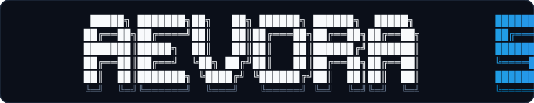

<div align="center">

<p align="center">
  
</p>


### **Autonomous SEO, AEO & GEO Intelligence Platform**
*The professional evidence-first search intelligence engine, local web crawler, and automated code remediation toolkit.*

[](https://www.npmjs.com/package/aevoraseo)
[](https://pypi.org/project/aevoraseo/)
[](https://github.com/bhedanikhilkumar-code/aevoraSEO/releases/tag/v1.1.0)
[](LICENSE)
[](pyproject.toml)
[](package.json)
[](#-tests--quality-assurance)
[](docs/setup.md)

<p align="center">
  <a href="#-what-is-aevoraseo"><b>Overview</b></a> •
  <a href="#-quick-start-zero-setup-runners"><b>Quick Start</b></a> •
  <a href="#-global-cli-installation"><b>Installation</b></a> •
  <a href="#-terminal-first-ai-agent--cli-skill-hub"><b>AI Agent Skill Hub</b></a> •
  <a href="#-the-7-pillars-of-modern-search-intelligence"><b>7 Pillars</b></a> •
  <a href="#-step-by-step-production-workflows"><b>Workflows</b></a> •
  <a href="#-automated-code-remediation-phase-k"><b>Auto-Remediation</b></a> •
  <a href="#-full-cli-command-reference-36-commands"><b>CLI Reference</b></a> •
  <a href="#-documentation-hub"><b>Docs</b></a>
</p>

---

</div>

## 🌐 What is AevoraSEO?

**AevoraSEO** is a developer-first, local-first search intelligence engine built for web engineers, growth teams, and autonomous AI coding agents. It converges **traditional technical SEO**, **Answer Engine Optimization (AEO)**, **Generative Engine Optimization (GEO)**, and **deterministic code patching** into one transparent, inspectable loop.

Traditional SEO platforms hide their formulas behind proprietary black-boxes and charge exorbitant monthly subscriptions. AevoraSEO runs **100% locally on your machine**:

* 🟢 **Free & Open Source (MIT License)** — No subscriptions, no cloud vendor lock-in, and zero third-party API keys required.
* 🔍 **Observable Ground-Truth Evidence** — Analyzes exact HTTP headers, robots directives, HTML AST, Schema.org entities, and live backlink source pages.
* 🛠️ **Closed-Loop Engineering** — Crawl ➔ Capture Evidence ➔ Diagnose ➔ Generate Patches ➔ Preview Unified Diffs ➔ Apply with Atomic Backup ➔ Verify Fix.

| 🌐 Crawl Target | 📦 Raw Evidence | 🧠 Diagnosis (SEO/AEO/GEO) | 🛠️ Code Patching | ✅ Verification |
|:---:|:---:|:---:|:---:|:---:|
| Multi-profile engine | Headers, DOM & Schema | 7-Pillar analysis | Deterministic AST patches | Zero regressions |


---

## ⚡ Quick Start (Zero-Setup Runners)

[](#-instant-run-via-node--javascript-ecosystem)
[](#-instant-run-via-node--javascript-ecosystem)
[](#-instant-run-via-node--javascript-ecosystem)
[](#-instant-run-via-python-ecosystem)

> [!TIP]
> **No repository cloning required.** Run AevoraSEO on any machine or CI pipeline without downloading source repositories or polluting your local disk with tests and playbooks.

### 🚀 Instant Run via Node / JavaScript Ecosystem

```bash
# 🟢 Using NPX (Built into Node.js — zero setup)
npx aevoraseo doctor
npx aevoraseo crawl https://example.com --profile quick --out ./runs/audit1
npx aevoraseo report ./runs/audit1 --format terminal

# ⚡ Using Bun (Instant start, ultra-low latency)
bunx aevoraseo doctor
bunx aevoraseo crawl https://example.com --profile quick --out ./runs/audit1

# 📦 Using PNPM
pnpm dlx aevoraseo doctor

# 🧶 Using Yarn
yarn dlx aevoraseo doctor
```

### 🐍 Instant Run via Python Ecosystem

```bash
# ⚡ Using UVX (Astral UV runner — blazing fast execution)
uvx aevoraseo doctor
uvx aevoraseo crawl https://example.com --profile quick --out ./runs/audit1

# 🛡️ Using pipx (Isolated application environment)
pipx run aevoraseo doctor
```

---

## 📦 Global CLI Installation

Install AevoraSEO globally to execute the `aevoraseo` command everywhere in your terminal, shell scripts, and build pipelines:

### 🟡 JavaScript & TypeScript Package Managers

```bash
# NPM (Global)
npm install -g aevoraseo

# PNPM (Global)
pnpm add -g aevoraseo

# Bun (Global)
bun add -g aevoraseo

# Yarn (Global)
yarn global add aevoraseo
```

### 🔵 Python Package Managers

```bash
# Modern UV tool (Recommended for Python users)
uv tool install aevoraseo

# Isolated pipx
pipx install aevoraseo

# Standard pip
pip install aevoraseo
```

Check your installed CLI version:
```bash
aevoraseo --version
aevoraseo doctor
```

---

## 🤖 Terminal-First AI Agent & CLI Skill Hub

[](docs/agent-installation.md)
[](docs/quick-access.md)
[](#4-verify-platform-compatibility)

AevoraSEO is designed specifically for **AI Coding Assistants**, **terminal agents**, and **agentic IDEs**. You can wire AevoraSEO as a native skill directly from your command line.

> [!NOTE]
> For universal master prompts and copy-paste skill instructions, read the [Quick Access Installation Hub](docs/quick-access.md).

### 1. Auto-Detect Your Active Environment

AevoraSEO inspects your active workspace, parent processes, and environment markers:

```bash
aevoraseo agent detect
# or via npx
npx aevoraseo agent detect
```

### 2. Supported Platforms Registry (18 Targets)

```bash
aevoraseo agent list
```

| Platform | Tier | Status | Invocation | Config Location |
|:---|:---:|:---:|:---|:---|
| **Claude Code** | `First-Party Skill` |  | `/aevoraseo` | `~/.claude/skills/aevoraseo/` |
| **Cursor / Windsurf** | `Workspace Rules` |  | Terminal / Rules | `.agents/skills/` or `.cursor/` |
| **Codex** | `First-Party Skill` |  | `$aevoraseo` | `~/.agents/skills/aevoraseo/` |
| **Gemini CLI / Antigravity** | `Agent Skill` |  | Terminal / Skill | `~/.gemini/skills/aevoraseo/` |
| **OpenClaw** | `Workspace Tool` |  | Prompt / Tool | `~/.openclaw/skills/aevoraseo/` |
| **Hermes** | `Profile Skill` |  | Profile / Skill | `~/.hermes/skills/aevoraseo/` |
| **Aider** | `CLI Integration` |  | Terminal / Map | `.aider/` |
| **GitHub Copilot CLI** | `Agent Extension` |  | `@copilot` | `.github/` |
| **Qwen / KiloCode / Droid** | `Adapter Config` |  | Native Invocation | Specific system paths |

### 3. One-Command Skill Wiring

Generate and wire up the skill adapter for your agent in one line:

```bash
# 🟣 Claude Code
aevoraseo agent adapt claude-code

# 🟢 Codex / ChatGPT Work
aevoraseo agent adapt codex

# 🔵 Gemini CLI / Google Antigravity
aevoraseo agent adapt gemini

# 🟠 OpenClaw
aevoraseo agent adapt openclaw

# 🟡 Cursor / Windsurf / VS Code Workspace
aevoraseo agent adapt cursor --workspace .
```

### 4. Verify Platform Compatibility

Run fixture-based testing to verify that your agent can invoke commands and parse JSON evidence:

```bash
aevoraseo agent verify --host claude-code
```

> [!IMPORTANT]
> Once installed, you can command your AI coding assistant:  
> *"Audit this website for AEO answer readiness and fix missing meta tags."*  
> The agent automatically executes AevoraSEO, inspects structured findings, generates AST code patches, and validates the fix!

---

## 🏛️ The 7 Pillars of Modern Search Intelligence

| 1. ⚙️ Technical SEO | 2. 💬 AEO (Answer Engines) | 3. 🧠 GEO (Generative Discovery) | 4. 🌐 Entity & Authority |
|:---|:---|:---|:---|
| Technical crawl, status codes, canonicals, metadata, link topology | Direct 40–60w answers, question intent, 10 AI bots accessibility | Factual density, citation readiness, knowledge extractability | Schema knowledge graph, sameAs footprint, consistency audits |

| 5. 🔗 Reputation & Backlinks | 6. 🎯 Search & Commercial | 7. 🛠️ Automated Code Remediation |
|:---|:---|:---|
| Verified sources, anchor context, evidence-first scoring | Intent taxonomy, keyword cannibalization, CTA audits | Deterministic AST/HTML code patches, atomic backups & rollback |


### 1. ⚙️ Traditional Technical SEO
Inspects crawlability, HTTP status codes, canonicals, redirect chains, `robots.txt`, XML sitemaps, title tags, meta descriptions, OpenGraph tags, and link topology (including orphan page detection).

### 2. 💬 AEO — Answer Engine Optimization
Audits content readiness for conversational question-answering engines. Identifies 40–60 word direct-answer definitions, procedural step lists, question heading coverage (`H2`/`H3`), and evaluates crawler accessibility across **10 tracked AI bots** (GPTBot, ClaudeBot, PerplexityBot, Applebot-Extended, Google-Extended, etc.).

### 3. 🧠 GEO — Generative Engine Optimization
Measures factual density, citation extractability, authoritative author bylines, publication timestamps, and structured knowledge representations that AI search models (SearchGPT, Perplexity, Gemini, Google SGE) prioritize when synthesizing citations.

### 4. 🌐 Entity & Knowledge Graph Intelligence
Parses typed Schema.org models (`Organization`, `Person`, `Product`, `LocalBusiness`, `Article`), resolves external `sameAs` authority links (Wikidata, Wikipedia, LinkedIn, Crunchbase), and detects cross-page consistency conflicts (name contradictions, telephone mismatches, broken profiles).

### 5. 🔗 Reputation & Backlinks
Verifies backlinks through direct source-page inspection. Evaluates anchor text, `rel` attributes (dofollow, nofollow, ugc, sponsored), and surrounding 160-character sentence context. Separates owned platforms from independent third-party editorial citations.

### 6. 🎯 Search Intent & Commercial Visibility
Classifies search intent (Informational, Commercial Investigation, Transactional, Navigational, Local), extracts primary target queries, detects internal keyword cannibalization via token similarity, validates local NAP consistency, and audits commercial conversion paths.

### 7. 🛠️ Automated Remediation Engine (Phase K)
Bridges the gap between auditing and engineering by compiling findings into deterministic, syntax-safe HTML patches with colorized diff previews, automatic pre-patch backups, and instant rollback.

---

## 🚀 Step-by-Step Production Workflows

### Step 1: Execute a Diagnostic Crawl

Collect technical evidence from a target website:

```bash
# Quick crawl (25 pages, standard rate limits)
aevoraseo crawl https://example.com --profile quick --out ./runs/site-baseline

# Deep crawl (Subdomains, sitemaps & max link discovery)
aevoraseo crawl https://example.com --profile deep --include-www --out ./runs/site-deep
```

*What happens:* AevoraSEO respects `robots.txt`, captures raw HTTP response headers, saves full HTML snapshots, builds an internal link graph, and persists observations in `./runs/site-baseline/crawl.sqlite3` and `pages.jsonl`.

---

### Step 2: Generate the Unified Client Audit

Synthesize technical, content, entity, AEO, and GEO findings into a scored scorecard:

```bash
# 📟 Colorized terminal summary
aevoraseo report ./runs/site-baseline --format terminal

# 📄 Standalone executive branded HTML presentation
aevoraseo report ./runs/site-baseline --format html --out ./deliverables

# 📊 Machine-readable JSON for CI/CD gates
aevoraseo report ./runs/site-baseline --format json --out ./deliverables
```

Open `./deliverables/audit-report.html` in any browser to inspect interactive health scores (0–100), critical P0 blockers, high-impact P1 opportunities, and P2 maintenance items.

---

### Step 3: Audit AEO & AI Crawler Accessibility

Inspect answer box feasibility and generative discovery signals:

```bash
aevoraseo aeo ./runs/site-baseline --format terminal
```

*Key findings:*
* **AI Bot Matrix:** Verifies if GPTBot, ClaudeBot, PerplexityBot, and Google-Extended are blocked or allowed in `robots.txt`.
* **Answer Readiness:** Measures coverage of 40–60 word answer boxes beneath question headings.
* **Heading Questions:** Scans `H2` and `H3` tags for question syntax (`what`, `how`, `why`, `where`, `can`).

---

### Step 4: Extract Schema.org Entity Knowledge Graph

```bash
aevoraseo entity ./runs/site-baseline --brand "My Brand" --format terminal
```

*Key findings:*
* Discovers typed entities (`Organization`, `LocalBusiness`, `FAQPage`, etc.) across JSON-LD, Microdata, and OpenGraph.
* Verifies `sameAs` entity links (Wikidata, Wikipedia, LinkedIn).
* Detects cross-page schema discrepancies (e.g., conflicting phone numbers or business names).

---

### Step 5: Detect Keyword Cannibalization

```bash
aevoraseo search ./runs/site-baseline --format terminal
```

*Key findings:*
* Analyzes query intent taxonomy (Informational, Transactional, Commercial).
* Flags internal cannibalization conflicts where multiple URLs compete for identical search intents.

---

## 🛠️ Automated Code Remediation (Phase K)

AevoraSEO does not just give you a checklist of issues — it **fixes them directly in your codebase** with deterministic precision.

| 1. Crawl Audit | 2. Generate Plan | 3. Preview Diff | 4. Apply Patches | 5. Verify Resolution |
|:---:|:---:|:---:|:---:|:---:|
| Run crawl & diagnose findings | Compile targeted patch plan | Colorized unified diffs | Atomic backup & SHA-256 | Re-crawl & verify zero regressions |


### Remediation CLI Workflow

```bash
# 1. Generate code patch plan from crawl evidence targeting your local website directory
aevoraseo remediate generate --crawl ./runs/site-baseline --site ./my-website-code --out ./remediation

# 2. Preview colorized unified diffs (inspect exact code changes before applying)
aevoraseo remediate preview --plan ./remediation/plan_*.json

# 3. Dry-run test (simulates patch application without touching disk)
aevoraseo remediate apply --plan ./remediation/plan_*.json --dry-run

# 4. Apply patches to disk with automatic atomic backup
aevoraseo remediate apply --plan ./remediation/plan_*.json

# 5. Rollback at any time if needed
aevoraseo remediate rollback --receipt ./remediation/receipt_*.json
```

### Safety Architecture
* 🛡️ **Deterministic AST HTML Patching** — Uses BeautifulSoup DOM parsing to guarantee valid tag structure and syntax.
* 🔐 **Cryptographic Digests** — Computes pre- and post-patch SHA-256 digests for every touched file in `receipt.json`.
* 💾 **Atomic Pre-Patch Backups** — Saves exact byte-level copies to `.aevora/backups/` before performing any modifications.
* ⏪ **Verified Rollback** — Restores the exact pre-patch byte state with verified checksum matching.

---

## 📋 Full CLI Command Reference (36 Commands)

| Command | Category | Description | Example Syntax |
|---|---|---|---|
| `crawl` |  | Crawl website structure and capture raw evidence | `aevoraseo crawl <url> --out <dir> [--profile quick\|deep]` |
| `scrape` |  | Inspect and capture a single web page | `aevoraseo scrape <url> --out <dir> [--mode browser]` |
| `watch` |  | Bounded change observation and re-crawling | `aevoraseo watch <url> --out <dir> --interval 3600` |
| `compare` |  | Diff two crawl snapshots (added, changed, removed) | `aevoraseo compare --before <dir1> --after <dir2>` |
| `report` |  | Generate unified audit report (Terminal, HTML, JSON, CSV) | `aevoraseo report <crawl-dir> --format html --out <dir>` |
| `aeo` |  | Analyze answer readiness and AI bot access matrix | `aevoraseo aeo <crawl-dir> --format terminal` |
| `aeo-compare` |  | Track AEO score progression between snapshots | `aevoraseo aeo-compare --before <d1> --after <d2>` |
| `entity` |  | Extract Schema.org entities and authority graph | `aevoraseo entity <crawl-dir> --format terminal` |
| `entity-compare`|  | Compare entity evolution and resolved conflicts | `aevoraseo entity-compare --before <d1> --after <d2>` |
| `search` |  | Analyze query intent, cannibalization & CTA friction | `aevoraseo search <crawl-dir> --format terminal` |
| `commercial` |  | Alias for `search` | `aevoraseo commercial <crawl-dir>` |
| `search-compare`|  | Compare search intent shifts across crawls | `aevoraseo search-compare --before <d1> --after <d2>` |
| `optimize` |  | Content quality, titles, headings, and answer boxes | `aevoraseo optimize <crawl-dir> --format terminal` |
| `content` |  | Alias for `optimize` | `aevoraseo content <crawl-dir>` |
| `optimize-compare`|  | Compare content scores and resolved deficiencies | `aevoraseo optimize-compare --before <d1> --after <d2>` |
| `remediate` |  | Automated code patching: generate, preview, apply, rollback | `aevoraseo remediate generate --crawl <c> --site <s>` |
| `audit-verify` |  | Verify if audit recommendations were fixed in new crawl | `aevoraseo audit-verify --audit <a.json> --crawl <dir>` |
| `progress` |  | Multi-snapshot score tracking over historical crawls | `aevoraseo progress --crawls <s1> <s2> <s3>` |
| `backlinks` |  | Inspect source pages for backlinks and anchor context | `aevoraseo backlinks <domain> --sources <file.csv>` |
| `reputation` |  | Calculate evidence-based reputation score (0–100) | `aevoraseo reputation <domain> --sources <file.csv>` |
| `reputation-compare`|  | Compare reputation snapshots for gained/lost links | `aevoraseo reputation-compare --before <r1> --after <r2>` |
| `present` |  | Export standalone branded client deliverables | `aevoraseo present --input <report.json> --format html` |
| `agent` |  | Platform integration: `detect`, `list`, `inspect`, `adapt`, `verify` | `aevoraseo agent detect`, `aevoraseo agent adapt <host>` |
| `doctor` |  | Validate local runtime, Playwright & network health | `aevoraseo doctor [--target <url>]` |
| `browser-setup`|  | Download & configure Playwright Chromium browser | `aevoraseo browser-setup` |
| `version` |  | Print current CLI version | `aevoraseo version` |

---

## 📊 Multi-Format Reporting & Executive Deliverables

Export your findings across five distinct formats tailored for different audiences:

* 📟 **Terminal (`--format terminal`)** — Interactive, colorized tables with clear status indicators (`PASS`, `WARN`, `FAIL`).
* 📄 **HTML (`--format html`)** — Executive-ready, standalone, mobile-responsive client presentation with interactive filtering.
* 💾 **JSON (`--format json`)** — Strict schema contracts designed for CI/CD pipelines and automated agent parsing.
* 📝 **Markdown (`--format markdown`)** — Formatted markdown summaries ready for GitHub PR descriptions or documentation.
* 📊 **CSV (`--format csv`)** — Spreadsheets fortified with formula injection defenses against `=`, `+`, `-`, `@`, `\t`, and `\r` vectors.

---

## 🛡️ Enterprise Security & Guardrails

* 🚫 **SSRF & Private Network Defense** — Blocks loopback (`127.0.0.1`), link-local (`169.254.x.x`), and private RFC 1918 subnets (`10.0.0.0/8`, `192.168.0.0/16`, `172.16.0.0/12`) by default.
* 🌐 **Strict Host Boundaries** — Crawler never leaves target domain boundaries unless explicitly allowed via `--allow-host`.
* 🤖 **Robots Directives Respect** — Respects `robots.txt` disallow rules and crawl delays by default.
* 🔒 **Spreadsheet Formula Sanitization** — All exported CSVs are sanitized against formula execution vulnerabilities.
* ⏱️ **Resource Quotas** — 5 MB response size limits, request timeouts, and maximum page ceilings prevent memory exhaustion.
* 🔏 **Zero Telemetry / Privacy by Default** — AevoraSEO never transmits your crawled data, audit findings, or codebase back to any remote analytics server.

---

## 🧪 Tests & Quality Assurance

* 🟢 **554 Passed Tests**, 2 skipped, 22 subtests across unit, integration, and adversarial suites.
* 🔁 **Deterministic Core** — Identical inputs yield identical outputs.
* 🛡️ **Zero Stub Policy** — No placeholder `TODO`, `FIXME`, or `NotImplementedError` stubs in production paths.

To run the local test suite:

```bash
python -m pytest tests/ -q
```

---

## 📚 Documentation Hub

Explore deep architectural guides and methodology references:

| Category | Guide | Description |
|---|---|---|
| **Skill Hub** | [docs/quick-access.md](docs/quick-access.md) | Universal master prompts & copy-paste skill installation |
| **Setup** | [docs/setup.md](docs/setup.md) | Environment configuration, Python, Node.js & Playwright |
| **Agent Integration** | [docs/agent-installation.md](docs/agent-installation.md) | Wiring AevoraSEO into 18 AI coding agents |
| **AEO & GEO** | [references/aeo-geo.md](references/aeo-geo.md) | Answer readiness criteria, scoring formulas & bot matrix |
| **Entity & Authority** | [references/entity-authority.md](references/entity-authority.md) | Knowledge graph parsing & conflict resolution |
| **Search Intelligence**| [references/search-commercial.md](references/search-commercial.md) | Intent taxonomy, query extraction & cannibalization |
| **Code Remediation** | [docs/remediation.md](docs/remediation.md) | Automated code patching, diffs & rollback |
| **Reputation Scoring** | [references/reputation.md](references/reputation.md) | Evidence-based reputation calculation |
| **Security & Permissions**| [docs/permissions.md](docs/permissions.md) | Security constraints, SSRF & network boundaries |
| **Branded Reports** | [docs/branded-reports.md](docs/branded-reports.md) | Customizing executive HTML/PDF client deliverables |
| **Full Index** | [docs/README.md](docs/README.md) | Complete documentation directory |

---

## 🤝 Contributing, Security & Community

Contributions are warmly welcomed! Please read [CONTRIBUTING.md](CONTRIBUTING.md) and review [SECURITY.md](SECURITY.md) before submitting a pull request.

---

## 📄 License

AevoraSEO is open-source software licensed under the **MIT License**. See [LICENSE](LICENSE) for full details.

---

## 👤 Author & Maintainer

**Bheda Nikhilkumar**  
*Software Engineer & Creator of AevoraSEO*

* 🐙 **GitHub:** [@bhedanikhilkumar-code](https://github.com/bhedanikhilkumar-code)
* 💼 **LinkedIn:** [Bheda Nikhilkumar](https://www.linkedin.com/in/bhedanikhilkumar)
* 🌐 **Portfolio:** [bhedanikhilkumar-portfolio](https://github.com/bhedanikhilkumar-code/Bheda-Nikhilkumar-portfolio)
* ✉️ **Contact:** [bhedanikhilkumarpro@gmail.com](mailto:bhedanikhilkumarpro@gmail.com)

<div align="center">
  <sub>Built with precision for the modern search and answer era. Evidence first. Clear reasoning. Better websites.</sub>
</div>
