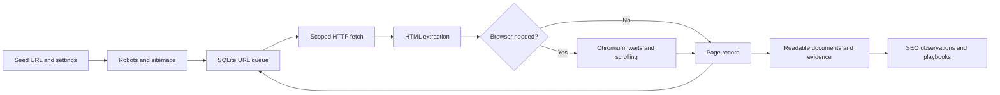

# How AevoraSEO works

AevoraSEO separates fetching, extraction and interpretation. Each stage keeps enough evidence to explain the next one.



## Source layout

| Path | Responsibility |
|---|---|
| `src/aevoraseo/cli.py` | Commands, input validation and output lock |
| `src/aevoraseo/network.py` | Configuration, normalized URLs, HTTP transport, pacing and robots rules |
| `src/aevoraseo/engine.py` | Sitemap discovery, SQLite queue, processing and exports |
| `src/aevoraseo/render.py` | Local browser, dependency routing, readiness, scrolling and screenshots |
| `src/aevoraseo/extract.py` | HTML observations, text selection and page finding candidates |
| `src/aevoraseo/content.py` | Common HTML structures converted to Markdown |
| `src/aevoraseo/diagnostics.py` | Access classification and stop reasons |
| `src/aevoraseo/evidence.py` | Shared representation selection, raw noindex preservation and missing-content candidates |
| `src/aevoraseo/backlinks.py` | Source verification, late-link rendering and bounded redirect follow-ups |
| `src/aevoraseo/reputation.py` | Search plans/imports, source review rubric, grouping and estimated reputation reports |
| `src/aevoraseo/discovery.py` | Budgeted provider adapters, host/saved imports, provenance, deduplication and cache |
| `src/aevoraseo/research.py` | Evidence packets, validated profile reviews, query generation and competitor gates |
| `src/aevoraseo/findings.py` | Evidence, business impact and acceptance contracts for audit findings |
| `src/aevoraseo/doctor.py` | Separate runtime and optional target/search probes |
| `src/aevoraseo/reports.py` | Offline branded HTML/PDF presentation of reviewed content and native audit findings |
| `src/aevoraseo/report_assets/` | Packaged product logo and self-contained report styles |
| `playbooks/` | SEO methods, templates, examples and industry guidance |
| `tests/` | Local HTTP/browser fixtures and regression cases |

HTTP workers fetch pages concurrently, with shared per-origin request spacing. Results are consumed in queue order. Browser observations run sequentially in fresh contexts; sessions and cookies do not cross pages. Browser HTTP requests are routed through the same checked transport. This makes request behavior inspectable, but differs from Chromium's ordinary direct network stack and does not replicate a normal browser's TLS fingerprint.

The SQLite database stores configuration, discovered URLs, page records and sitemap membership. A run can recover its pending queue. It does not implement cross-run incremental refresh. Reports and content exports are regenerated from stored records without fetching a website again.

## Python usage

```python
from aevoraseo import Config, Crawler

config = Config(
    url="https://example.com",
    max_pages=10,
    render_mode="auto",
    timeout=40,
)
crawler = Crawler(config, "runs/python-example")
try:
    summary = crawler.run()
    print(summary["html_documents"])
finally:
    crawler.close()
```

Use one `Crawler` per output directory and always close it. The CLI provides an output lock; direct library users must avoid concurrent writers to the same directory. The public classes are a small Python interface, not an asynchronous hosted API.

## Interpretation boundaries

A page observation establishes what this run received. It does not establish what a search engine indexed or what a user saw on a different device, geography, session or date. SEO findings remain evidence-bearing candidates until interpreted in context. Read the [measurement boundaries](../references/measurement-boundaries.md) before turning them into business conclusions.
